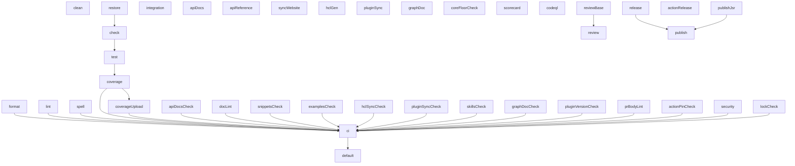

# Zuke's build graph

<!-- Generated by `./zuke graphDoc` — do not edit by hand. -->

The dependency graph of [`zuke.ts`](../zuke.ts) — Zuke building itself. An arrow points from a dependency to the target that depends on it, so a target runs after everything that points at it. This is the same graph `./zuke graph` prints as text and `./zuke graph --output=html` renders interactively.

40 target(s), 26 dependency edge(s). Regenerate with `./zuke graphDoc`; the `graphDocCheck` target in the CI gate fails when this page drifts from the build.

## Targets

| Target | Description | Depends on |
| --- | --- | --- |
| `clean` | Remove build artifacts | — |
| `restore` | Warm the module cache | — |
| `format` | Check formatting (deno fmt --check) | — |
| `lint` | Lint the workspace (deno lint) | — |
| `spell` | Spell-check the repository (cspell) | — |
| `check` | Type-check the whole workspace | `restore` |
| `test` | Run the test suite with coverage | `check` |
| `integration` | Run the subprocess e2e suite (real processes, OS matrix) | — |
| `coverage` | Enforce the 95% coverage gate | `test` |
| `coverageUpload` | Upload the coverage report to Codecov | `coverage` |
| `apiDocs` | Generate agent-readable API docs (llms.txt, llms-full.txt, READMEs) | — |
| `apiDocsCheck` | Verify the generated API docs are current | — |
| `apiReference` | Generate the structured API reference (dist/api.json) for the website | — |
| `syncWebsite` | Open and merge a website PR with refreshed llms.txt + api.json | — |
| `docLint` | Fail on missing JSDoc or first-party private-type refs (deno doc --lint) | — |
| `snippetsCheck` | Type-check the marked ts snippets in docs and skills | — |
| `examplesCheck` | Type-check every example project and list its targets | — |
| `hclGen` | Regenerate the Terraform/OpenTofu wrappers from one template | — |
| `hclSyncCheck` | Verify the Terraform/OpenTofu wrappers match their template | — |
| `pluginSync` | Sync plugins/zuke/skills/ from skills/ (real copies, not a symlink) | — |
| `pluginSyncCheck` | Verify plugins/zuke/skills/ matches skills/ (no drift) | — |
| `skillsCheck` | Validate skills/ against the Agent Skills spec (frontmatter, names) | — |
| `graphDoc` | Regenerate docs/graph.md — this build's graph as a Mermaid page | — |
| `graphDocCheck` | Verify docs/graph.md matches the current build graph | — |
| `pluginVersionCheck` | Verify a skills change also bumped the plugin version | — |
| `prBodyLint` | Fail if the PR body has code release-please's parser can't handle | — |
| `coreFloorCheck` | Type-check every package against the @zuke/core version it declares | — |
| `lockCheck` | Verify the run did not rewrite deno.lock | — |
| `security` | Run supply-chain security scanners (zuke/security) | — |
| `actionPinCheck` | Verify the workflows only use inputs the released action has | — |
| `ci` | Full pre-commit / CI gate | `format`, `lint`, `spell`, `coverage`, `coverageUpload`, `apiDocsCheck`, `docLint`, `snippetsCheck`, `examplesCheck`, `hclSyncCheck`, `pluginSyncCheck`, `skillsCheck`, `graphDocCheck`, `pluginVersionCheck`, `prBodyLint`, `actionPinCheck`, `security`, `lockCheck` |
| `scorecard` | OpenSSF Scorecard (runs in CI via scorecard.yml) | — |
| `codeql` | CodeQL static analysis (runs in CI via codeql.yml) | — |
| `reviewBase` | Fetch the base branch the AI review diffs against | — |
| `review` | AI review of the diff (security + code quality) | `reviewBase` |
| `release` | Maintain release PRs and GitHub releases (release-please) | — |
| `actionRelease` | Tag a new version of the Marketplace action when it changed | — |
| `publishJsr` | Publish new package versions to JSR, core first | — |
| `publish` | Release then publish new versions to JSR | `release`, `publishJsr` |
| `default` | Default: run the full CI gate | `ci` |
